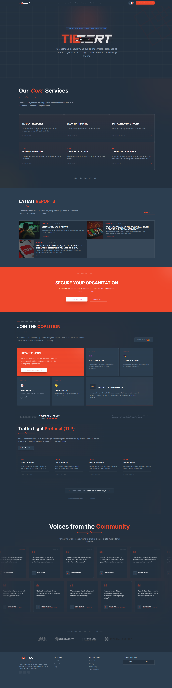

# TIBCERT (Tibetan Computer Emergency Response Team)

This is the official website for **TIBCERT**, a digital security initiative dedicated to enhancing cybersecurity for the Tibetan community. Built with **Astro** and **Tailwind CSS**, this platform provides critical security resources, reports, and AI-driven assistance.

---


## 📖 Project Documentation

### Overview

TIBCERT serves as a digital security hub providing resources, reports, services, and AI-powered assistance to the Tibetan community.

### Technology Stack

- **Framework**: [Astro](https://astro.build/) (v5.x)
- **Styling**: [Tailwind CSS](https://tailwindcss.com/) (v4.x)
- **AI Integration**: Google Gemini API via `@google/generative-ai`
- **Content Management**: Astro Content Collections (Markdown/MDX)
- **Type Safety**: TypeScript

### Project Structure

```text
/
├── public/              # Static assets (images, icons, robots.txt)
├── src/                 # Source code
│   ├── assets/          # Project assets (images, fonts, etc.)
│   ├── components/      # Reusable UI components
│   │   ├── cards/       # Card-based UI elements
│   │   ├── common/      # Shared components (Navbar, Footer, GeminiChat, etc.)
│   │   └── landing/     # Components specific to the landing page
│   ├── content/         # Managed content collections
│   │   └── blog/        # Blog posts and reports
│   ├── layouts/         # Page layouts (Main Layout.astro)
│   ├── pages/           # Route definitions (.astro, .md)
│   ├── styles/          # Global styles (Tailwind, animations)
│   └── utils/           # Utility functions and helpers
├── astro.config.mjs     # Astro configuration
├── package.json         # Dependencies and scripts
└── tsconfig.json        # TypeScript configuration
```

### Key Features

- **AI Assistant**: Integrated Gemini-powered chatbot for real-time security advice.
- **Project Content**: Managed security reports and blog posts in `src/content/blog/`.
- **Live Blog Feed**: Automated synchronization with [blog.tibcert.org](https://blog.tibcert.org) via RSS for the latest community reports.
- **Social Media Integration**: Real-time display of recent insights and engagement from **Instagram** and **Facebook**.
- **Cyber-Tech UI**: Modern aesthetic with scanlines, grainy noise, and dark mode support.
- **TLP Implementation**: Information sharing guidelines using Traffic Light Protocol.

---

## 🛠 Developer Guide

### Getting Started

1. **Prerequisites**: Ensure you have Node.js (LTS) installed.
2. **Install Dependencies**:

   ```bash
   npm install
   ```

3. **Environment Setup**: Create a `.env` file and add your `GEMINI_API_KEY`.

### Development Workflow

- **Local Dev Server**: `npm run dev` (available at `http://localhost:4321`)
- **New Pages**: Add `.astro` or `.md` files to `src/pages/`.
- **Styling**: Use Tailwind utility classes; global styles are in `src/styles/global.css`.
- **Content**: Add new reports to `src/content/blog/` following the schema in `src/content/config.ts`.

### Build and Deployment

- **Build**: `npm run build` (outputs to `dist/`)
- **Preview**: `npm run preview`

### Useful Commands

| Command | Purpose |
| :--- | :--- |
| `npm run dev` | Start development server |
| `npm run build` | Build for production |
| `npm run preview` | Preview production build |
| `npx astro check` | Check for Astro/TS errors |

---

## 🚀 Deployment to Vercel

The TIBCERT website is optimized for deployment on **Vercel**. Follow these steps to deploy:

1. **Push to GitHub**: Ensure your latest changes are pushed to your GitHub repository.
2. **Import to Vercel**:
   - Log in to your [Vercel Dashboard](https://vercel.com/dashboard).
   - Click "Add New" -> "Project".
   - Import your TIBCERT repository.
3. **Configure Build Settings**: Vercel should automatically detect **Astro**.
   - Framework Preset: `Astro`
   - Build Command: `npm run build`
   - Output Directory: `dist`
4. **Setup Environment Variables**: (See the Google AI Studio Guide below).
5. **Deploy**: Click "Deploy". Vercel will build and host your site.

---

## 🤖 Google AI Studio Setup Guide

To enable the AI capabilities (Gemini Chat), you must configure your API keys.

### 1. Obtain an API Key

- Go to [Google AI Studio](https://aistudio.google.com/).
- Create a new project or select an existing one.
- Click on **"Get API key"** and generate a new key.

### 2. Local Setup

Create a `.env` file in the root directory:

```text
GEMINI_API_KEY=your_generated_api_key
```

### 3. Vercel / Production Setup

To make the AI work in production, you must add the environment variable in Vercel:

- In your Vercel Project Dashboard, go to **Settings** -> **Environment Variables**.
- Add a new variable:
  - **Key**: `GEMINI_API_KEY`
  - **Value**: `[Your API Key]`
- Redeploy your project for the changes to take effect.

### 4. Rate Limits & Quotas

The Gemini API **Free Tier** has specific usage limits:

- **1.5 Flash**: 15 Requests Per Minute (RPM), 1,500 Requests Per Day (RPD).
- **1.5 Pro**: 2 Requests Per Minute (RPM), 50 Requests Per Day (RPD).

If you see a "Rate Limit Reached" error, simply wait a minute before trying again. For higher traffic requirements, consider upgrading to the "Pay-as-you-go" tier in Google AI Studio.

---

### 🛡️ Local-First AI Knowledge (NEW)

Your AI assistant supports **Immediate Context Injection**. This allows the AI to gain expert knowledge without requiring a custom-trained model from Google AI Studio.

- **How it works**: The `GeminiChat.astro` component automatically reads `fine_tuning_final.json` and injects its content into every new chat session as "background context".
- **Benefit**: No setup required. The AI will immediately know about TIBCERT's mission, specific threats (like BADBAZAAR), and team members as soon as you add the entries to the JSON file.
- **Priority**: If you provide a `PUBLIC_TUNED_MODEL_ID` in your `.env`, the local injection is automatically disabled to save tokens and avoid redundant data.

#### How to update the Knowledge Base

1. Open `fine_tuning_final.json` in the root directory.
2. Add a new object to the array following the "messages" structure:

   ```json
   {
     "messages": [
       { "role": "user", "content": "Your Question Here" },
       { "role": "model", "content": "Your Expert Answer Here" }
     ]
   }
   ```

3. Save the file. The AI will use this new information in the next chat session.

---

### 🚨 Troubleshooting & API Errors

If the AI assistant returns an error message, check the following common causes:

| Error Message | Cause | Solution |
| :--- | :--- | :--- |
| **"API Key Error"** | Invalid or missing key. | Check your `.env` file for `GEMINI_API_KEY`. |
| **"Rate Limit Reached"** | Too many requests on Free Tier. | Wait 60 seconds. Free tier is limited to 15 RPM. |
| **"Model Not Found"** | Incorrect Model ID. | Ensure `PUBLIC_TUNED_MODEL_ID` is correct or leave it empty to use the default `1.5-flash`. |
| **"Safety Filter Block"** | Request triggered safety guardrails. | Rephrase your question to be more technical or less sensitive. |

---

## 🎯 Fine-Tuning Your AI

To make the TIBCERT AI more knowledgeable about your specific organization and community needs, you can **Fine-Tune** a custom Gemini model. I have expanded the dataset using official project content and external threat intelligence.

### 1. Choose Your Dataset

- **[fine_tuning_final.json](./fine_tuning_final.json) (Recommended)**: The master dataset containing 16+ high-quality Q&A pairs derived from `tibcert.org`, `blog.tibcert.org`, and internal documents. Covers team, mission, and specific technical threats.
- **[fine_tuning_samples.json](./fine_tuning_samples.json)**: A basic template for quick testing.
- **[advanced_fine_tuning.json](./advanced_fine_tuning.json)**: Focuses on deep organizational IDs and service internal logic.

### 2. Setup in Google AI Studio

> [!NOTE]
> **Why use Google AI Studio?** While the `.json` files are stored locally, they are "textbooks" for the AI, not the "brain" itself. Fine-tuning is a computationally intensive process where Google's servers read your data to adjust the model's internal weights. Once trained, Google hosts the new "expert" model for you.

1. Log in to [Google AI Studio](https://aistudio.google.com/).
2. Click on **"Create Tuned Model"**.
3. Choose a base model (e.g., `gemini-1.5-flash`).
4. Select **"Import"** and upload your chosen JSON file (e.g., `fine_tuning_final.json`).
5. **Crucial**: Copy the contents of your [System Instructions](./.gemini/antigravity/brain/9af17c23-1403-40dd-918d-719c9dfcf2b3/system_instructions.md) into the **System Instructions** field in AI Studio to set the expert persona.
6. Click **"Tune"**. Google will generate a unique **Model ID** once complete.

---

## 🚀 Advanced Fine-Tuning (Expert Mode)

For more precise results, you can use the **Advanced Tuning** options in Google AI Studio:

### Hyperparameter Options

- **Epochs**: Increase to 4-5 for better retention of specific terminology.
- **Learning Rate**: Use a lower rate (e.g., 0.0001) for more stable training with technical data.

### Threat Intelligence Coverage

The `fine_tuning_final.json` dataset specifically includes intelligence on:

- **Mobile Spyware**: BADBAZAAR and MOONSHINE analysis.
- **Hardware Risks**: Vulnerabilities in Chinese-made Android devices (Vivo, Redmi, Oppo).
- **Network Attacks**: Cellular roaming attacks ("Welcome to China" spoofing).
- **Proactive Defense**: PWA benefits and secure browser configurations.

### 3. Update Your Code

Once your model is tuned, you will receive a custom **Model ID**. Update `src/components/common/GeminiChat.astro` to use your new model:

```javascript
const model = genAI.getGenerativeModel({ model: "tunedModels/your-custom-model-id" });
```

---
*Maintained by the TIBCERT Team.*


*Project of Tibetan Institute*

